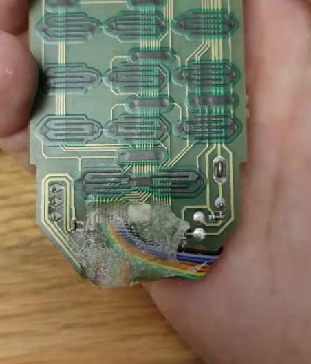

# zb49remoter
This project is base on Freepad https://modkam.ru/?p=1264<br>
Expand the key to 7x7 49 or 7x8 56 and put is into a Huawei tv box remoter.<br>
To expand it only support button single click.<br>
Key1 to Key20 report button_1_single to button_20_single.<br>
Key21 to Key40 report button_1_double to button_20_double.<br>
Key41 to Key56 report button_1_triple to button_16_triple.<br>
If set key1 to Key20 to multifunction K1 to K20 support single hold and release.<br>
Have modified the key interval to 80ms so can response quick click.<br>
For more details how to join please refer to Freepad.<br>
 
# Keymap
P0_2 = row_1 P0_3 = row_2 P0_4 = row_3 P0_5 = row_4 P0_6 = row_5 P0_7 = row_6 P0_0 = row_7<br>
P1_2 = col_1 P1_3 = col_2 P1_4 = col_3 P1_5 = col_4 P1_6 = col_5 P1_7 = col_6 P1_1 = row_7 P2_0 = row_8<br>
Key code = (row-1)*8+col, eg. P0_4 to P1_5 is 2x8+4 = 20<br>
For dont know what reason P1_1 will follow P1_0 so can not use P1_0 as row_8 then use P2_0 instead of P1_0 for the row 8 to expand key to 56 key.<br>
If you want do make an pcb to fit your remoter just remove the no need key.<br>
 
# other choose
The HP MCE remoter is 49 key and it are row7 and col7 so after remove the IC on PCB we can use wire to connect with E18 zigbee module.<br>
Here are the pictures of this remoter and modified PCB <br>
  

# Freepad

Freepad is an open source Zigbee remote intended to be used to have a customizable keypad to control your smart home devices.  
Read more here: https://modkam.ru/?p=1264

## Features list:
1. 49 key single
2. Touchlink reset
3. ONOFF bind
4. Level control bind
5. Bindings configuration
6. Remote reset


## How to join:

1. Press and hold *first* button for 3-10 seconds(depends whter or not device is on a network), until device start flashing led
2. Wait, in case of successfull join, device will flash led 5 times
3. If join failed, device will flash led 3 times

## How to use touch link
 Deprecated due to memory issues, you can use `FREEPAD_ENABLE_TL` macros if you want to compile with TL functionality


## What's button mapping?


## How to add device into zigbe2mqtt
Should be already in dev branch (as of 19-05-2020)


## Work modes
By default remote works as custom swith, with multiple clicks, this behaiviout has own drawback.
In order to detect multiple clicks, remote sends commands with 300ms delay.
You can change this behaviour by cost of double/tripple/etc clicks. 
To do that you need to change

`ZCL_CLUSTER_ID_GEN_ON_OFF_SWITCH_CONFIG` cluster `ATTRID_ON_OFF_SWITCH_TYPE` attribute

Values are:

`ON_OFF_SWITCH_TYPE_MOMENTARY` (0) -> no delay, but no multiple clicks, only single

```bash
mosquitto_pub -t "zigbee2mqtt/FN/BUTTON_NUM/set/switch_type" -m '0'
```

`ON_OFF_SWITCH_TYPE_MULTIFUNCTION` (2) -> 300ms delay, full set of clicks

```bash
mosquitto_pub -t "zigbee2mqtt/FN/BUTTON_NUM/set/switch_type" -m '2'
```


## ONOFF cluster binding
By default command is TOGGLE, but you can change this behaviour

Change `ZCL_CLUSTER_ID_GEN_ON_OFF_SWITCH_CONFIG` clusters attribute `ATTRID_ON_OFF_SWITCH_ACTIONS`

`ON_OFF_SWITCH_ACTIONS_ON`

```bash
mosquitto_pub -t "zigbee2mqtt/FN/BUTTON_NUM/set/switch_actions" -m '0'
```

`ON_OFF_SWITCH_ACTIONS_OFF`

```bash
mosquitto_pub -t "zigbee2mqtt/FN/BUTTON_NUM/set/switch_actions" -m '1'
```

`ON_OFF_SWITCH_ACTIONS_TOGGLE` (default value)

```bash
mosquitto_pub -t "zigbee2mqtt/FN/BUTTON_NUM/set/switch_actions" -m '2'
```
